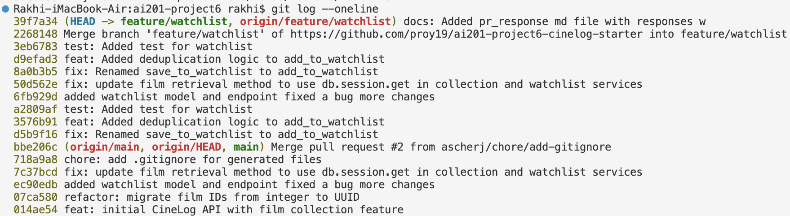

# PR Response Doc — CineLog Watchlist Feature

## AI Usage
I used Claude to cross-check the watchlist changes against the existing collection_service.py/test_collection.py patterns rather than eyeballing the resemblance myself. Specifically:

Pattern verification for the dedup logic: Before writing AlreadyInWatchlistError and the duplicate check in add_to_watchlist(), I had it read add_to_collection() line-by-line and confirm the exact shape I should follow (query-by-filter_by(user_id, film_id).first(), then raise before insert, then create/add/commit) so the two services stay consistent for anyone reading both later, rather than me inventing a subtly different dedup style.

## Comment 1 — Rename
**What I did:**
Renamed `save_to_watchlist()` to `add_to_watchlist()` in `watchlist_service.py` and updated its one call site in `routes/watchlist.py`.
**How I verified:**
Searched for remaining references to the old name and confirmed none were left.

## Comment 2 — Deduplication
**What I did:**
Added a duplicate check to `add_to_watchlist()`: introduced `AlreadyInWatchlistError` and query for an existing entry before inserting, matching the pattern in `add_to_collection()`.
**How I verified:**
Compared the new logic side-by-side with `add_to_collection()` to confirm it follows the same check-then-raise pattern. Haven't run a live duplicate-insert test yet — recommend adding `test_add_to_watchlist_duplicate_raises` before merge.

## Comment 3 — Missing test
**What I did:**
Created `tests/test_watchlist.py` with `test_add_to_watchlist_nonexistent_film_raises`, mirroring `test_collection.py`'s fixture and assertion structure (same `app`/`sample_user` fixtures, same `pytest.raises` pattern). Used an integer fake film ID instead of a UUID, since `watchlist_service.py` still treats `film_id` as an integer (pre-refactor).
**How I verified:**
Compared the new test line-by-line against `test_add_to_collection_nonexistent_film_raises` to confirm the fixture setup and assertions match. Ran the tests to make sure it was successful. 

## Comment 4 — Default visibility
**My position:** 
I'm defaulting new watchlist entries to public=True, and I want to make that intentional rather than incidental.
**Reasoning:**
The core bet is that watchlists are aspirational, not diagnostic. Unlike a collection (films someone has actually watched and possibly rated), a watchlist just says "I want to see this." There's very little here that feels private or embarrassing — wanting to watch a movie carries almost none of the self-disclosure risk that, say, a low rating or a guilty-pleasure "watched" entry might. Because of that, I think the behavior we want to optimize for is discovery and social proof: watchlists are far more useful to the product (and to other users) when they're visible by default, since they power "friends want to see" surfaces, recommendation signals, and the general sense that the app has active users doing things. If we default to private, we're betting that most users will actively flip a switch to get that value, and in my experience with opt-in visibility settings, most users never touch the default — so a public=False default would functionally mean "almost nothing is ever public," which quietly kills those features before they can prove out.
**Tradeoff acknowledged:**
Some users will be surprised that their watchlist is visible to others out of the gate, and for a subset of people, "movies I want to watch" is more revealing than it sounds (e.g., it can signal mood, identity, or things they'd rather not broadcast — think sensitive documentaries or content tied to personal circumstances). Defaulting to public trades a real, if narrow, privacy expectation-violation for broader engagement with the social features. I think that's the right trade for a watchlist specifically (I would not make the same call for collections or ratings), but it does mean we owe users a clear, easy-to-find toggle and probably a one-time surfaced notice ("your watchlist is public — change this anytime") rather than burying the setting.
If we'd rather optimize for trust-by-default instead of adoption-by-default, the alternative is public=False, accepting slower growth of the social features in exchange for never surprising anyone. I don't think that's the wrong instinct, just a different bet — happy to discuss if the team leans that way.

## Comment 5 — Sort order
**My position:** 
I'll take the maintainer's side on this one to default to "date added" order. 
**Reasoning:**
Agreed — switching to date-added order, newest first.
Your instinct matches the actual use case better than mine did. Alphabetical made sense to me as a "browsable list" default, but a watchlist isn't really a reference list someone alphabetizes to look something up — it's closer to a queue. The behavior I'd expect from a real user is: add a few films after a conversation or a trailer, then come back later and ask "wait, what did I add recently?" Alphabetical actively fights that — a film added five minutes ago could land at the bottom of the list, buried under everything starting with A–L, which is the opposite of what you want for a "check what's new" glance.
The one case alphabetical helps is finding a specific title in a long list — but that's a search/filter problem, not a default-sort problem, and it's also the weaker use case here (collections are the "look something up" list; watchlists are the "what's next" list).
**Engagement with reviewer's point:**
Agreed — switching to date-added order, newest first.

## Comment 6 — Rebase
**What conflicted:** The UUID was conflicting with incoming changes. 
**How I resolved it:** 
Resolve the UUID conflict by updating your watchlist code to use UUIDs where it still references integer IDs
**How I verified no conflict remains:** 
There were no merge conflicts when I tried to rebase changes. 

## PR Description
Summary
This PR adds the watchlist feature to CineLog. A watchlist lets a user save films they want to watch in the future, as distinct from their collection (films they've already watched and rated). It includes:

services/watchlist_service.py — business logic for adding to and reading a watchlist
routes/watchlist.py — GET /watchlist/<user_id> and POST /watchlist/<user_id>/add endpoints
tests/test_watchlist.py — service-level tests

Design decisions
1. Visibility default: public=True
New watchlist entries default to public. The reasoning: watchlists are aspirational ("I want to see this"), not diagnostic like a rating or a watched-history entry, so they carry much less self-disclosure risk. Defaulting to public is what makes the feature useful for discovery and social features (e.g. "friends want to see"); a private-by-default setting would mean most users never surface anything, since opt-in visibility settings are rarely changed from their default. The tradeoff: a small number of users may be surprised their watchlist is visible out of the gate, so we should make the toggle easy to find and consider a one-time notice. Open to revisiting if the team prefers a trust-by-default approach instead.
2. Sort order: date added, newest first
get_watchlist() returns entries ordered by date_added.desc(), not alphabetically. A watchlist behaves like a queue — the common use case is "what did I just add," not "let me look something up by title," which is more of a collection use case. This also aligns the sort semantics with get_collection(), which already sorts newest-first.
Manual testing steps

Start the app locally and ensure the database is migrated with the WatchlistEntry model.
Create a test user and at least 3 films in the database.
Add to watchlist:

POST /watchlist/<user_id>/add with body {"film_id": <id>} for each film, a few seconds apart.
Confirm each call returns 201 with the created entry.

View watchlist / sort order:

GET /watchlist/<user_id>.
Confirm the most recently added film appears first, and the first film added appears last (newest-first order).

Duplicate check:

Re-POST the same film_id used in step 3.
Confirm this raises AlreadyInWatchlistError (currently surfaces as a 500 — see open item below) rather than creating a second entry.
Confirm via direct DB query (or a repeated GET) that no duplicate entry was created.

Nonexistent film:

POST /watchlist/<user_id>/add with a film_id that doesn't exist (e.g. 999999).
Confirm FilmNotFoundError is raised rather than a raw DB integrity error.

Public flag:

Confirm each entry returned by GET /watchlist/<user_id> includes "public": true by default.

## Git Log Screenshot

